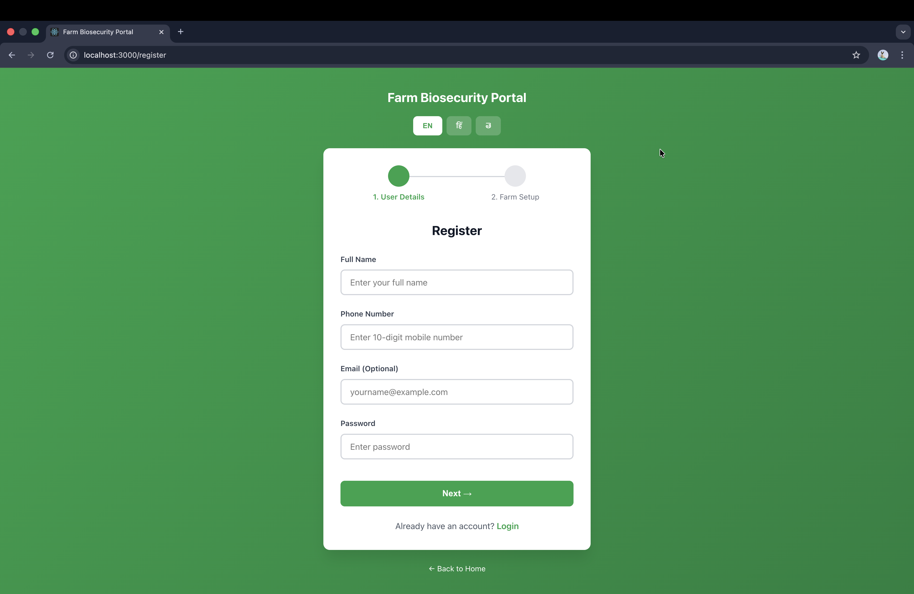
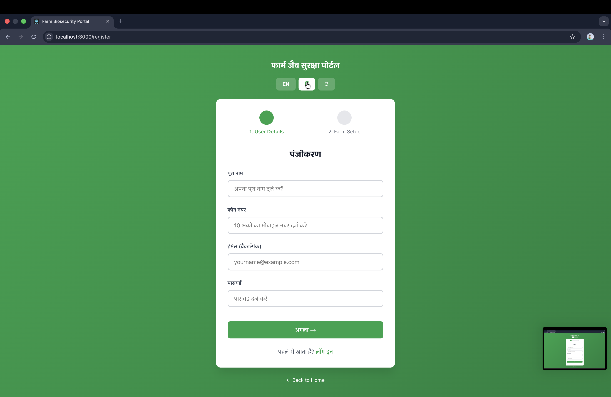

# 🐄🐔 Digital Farm Biosecurity Portal
## Presentation Deck

---

## Slide 1: Problem Statement

### 🚨 The Challenge

- **80%** of India's livestock is with small/marginal farmers
- Limited access to biosecurity information
- Disease outbreaks cause **₹50,000-₹1,00,000** loss per farm
- No digital tools available in local languages
- Paper-based compliance tracking is inefficient

---

## Slide 2: Our Solution

### 📱 Digital Farm Biosecurity Portal

A **Progressive Web App** that brings biosecurity management to every farmer's smartphone.

**Key Innovation:**
- Works offline (PWA technology)
- Multilingual (Hindi, English, Telugu)
- Mobile-first design for low-end devices
- No app store download required

---

## Slide 3: Core Features

| Feature | Description |
|---------|-------------|
| 🎯 **Risk Assessment** | Interactive questionnaire with instant feedback |
| 🚨 **Disease Alerts** | Real-time location-based outbreak notifications |
| 📊 **Dashboard** | Visual farm health metrics and trends |
| ✅ **Compliance Tracker** | DADF-aligned certification tracking |
| 🌐 **Multilingual** | Full support for Hindi, English, Telugu |

---

## Slide 4: Technology Stack

```
┌─────────────────────────────────────┐
│           FRONTEND                   │
│  React 18 + Redux + PWA + i18next   │
└─────────────────────────────────────┘
                 │
                 ▼
┌─────────────────────────────────────┐
│           BACKEND                    │
│   Node.js + Express + JWT Auth      │
└─────────────────────────────────────┘
                 │
                 ▼
┌─────────────────────────────────────┐
│           DATABASE                   │
│      MongoDB + Cloudinary           │
└─────────────────────────────────────┘
```

---

## Slide 5: User Journey

```
1. 📲 Install PWA (no app store)
        ↓
2. 📝 Register with farm details
        ↓
3. 🎯 Complete risk assessment
        ↓
4. 📊 View dashboard & recommendations
        ↓
5. 🔔 Receive disease alerts
        ↓
6. ✅ Track compliance progress
```

---

## Slide 6: Screenshots

### Main Dashboard


### Multilingual Support
| English | Hindi |
|---------|-------|
|  |  |

---

## Slide 7: Impact Metrics

| Metric | Target |
|--------|--------|
| 👨‍🌾 Active Farmers | 1,000+ in 6 months |
| ⏱️ Disease Response | 3-5 days → <24 hours |
| 📈 Compliance Rate | 40% improvement |
| 💰 Cost Savings | ₹50,000-₹1,00,000 per farm |
| 📊 Data Collection | 10,000+ farm records |

---

## Slide 8: Competitive Advantage

| Feature | Our Solution | Competitors |
|---------|-------------|-------------|
| Offline Support | ✅ Full PWA | ❌ Requires internet |
| Languages | ✅ 3+ Indian | ❌ English only |
| Device Support | ✅ Any smartphone | ❌ High-end only |
| Cost | ✅ Free | ❌ Subscription |
| Installation | ✅ No app store | ❌ App store required |

---

## Slide 9: Scalability

```
Phase 1: Pilot (1,000 farmers)
    └── 3 states, 2 languages
    
Phase 2: Regional (10,000 farmers)
    └── 10 states, 5 languages
    
Phase 3: National (100,000+ farmers)
    └── All states, 10+ languages
```

**Technical Scalability:**
- Cloud-native architecture
- Horizontal scaling ready
- CDN for static assets
- Database sharding support

---

## Slide 10: Team & Contact

### 👥 Development Team

Built for the **Ministry of Fisheries, Animal Husbandry & Dairying Hackathon**

### 📞 Contact

- **GitHub**: [Repository Link](https://github.com/omrajputt369-byte/animal-health-management-system)
- **Email**: support@farmbiosecurity.gov.in

---

## Slide 11: Thank You!

### 🙏 धन्यवाद | Thank You | ధన్యవాదాలు

**Ready to transform farm biosecurity in India!**

---

*Built with ❤️ for Indian farmers*
